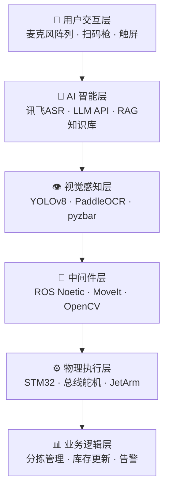
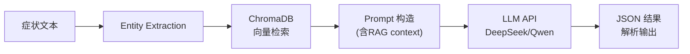
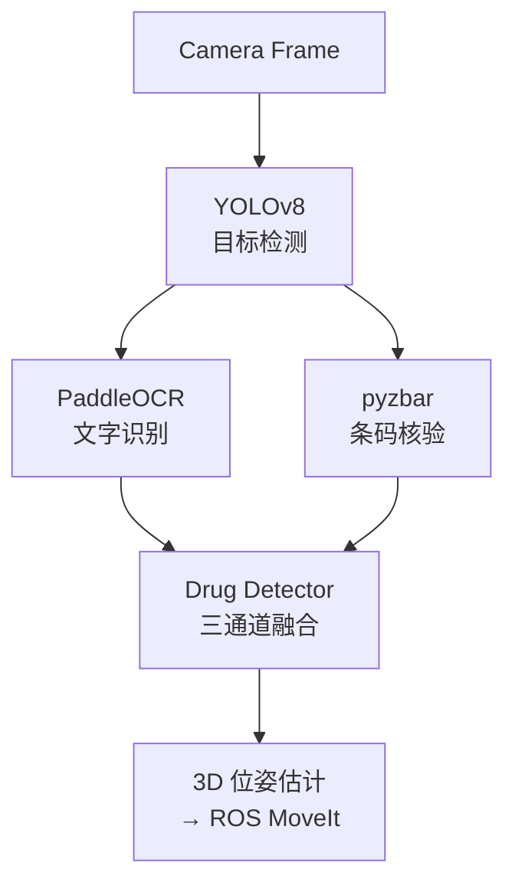
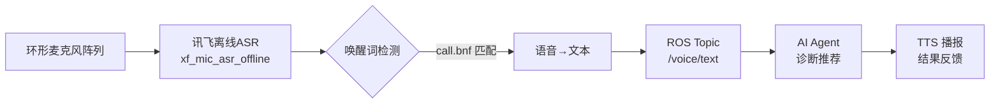
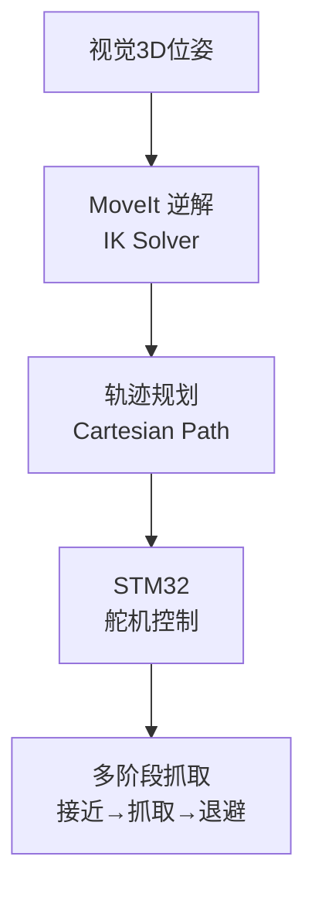

# PharmacyBot 🏥🤖
## 智能药房机械臂分拣与AI诊断推荐系统

项目答辩 · 商业计划书路演

<br>

> 基于 Jetson Orin NX + ROS Noetic + 云端 LLM API
> 实现"语音诊断 → AI推荐 → 视觉定位 → 机械臂分拣"全闭环

<div class="abs-br m-6 flex gap-2">
  <a href="https://github.com/15934110986pmq-debug/pharmacy_bot" target="_blank" class="text-xl icon-btn opacity-50 !border-none !hover:opacity-100">
    GitHub
  </a>
</div>

---

# 目录 📋

<div grid="~ cols-2 gap-4" class="mt-4">

<div>

1. **项目背景** — 药房人力短缺与智能化需求
2. **项目概述** — 系统定位与核心创新
3. **市场分析** — 智慧药房市场规模
4. **产品设计** — 三大核心技术板块
5. **系统架构** — 六层架构 & 数据流
6. **商业模式** — 盈利模式与定价策略
</div>
<div>

7. **财务分析** — 收入预测与成本结构
8. **AI 智能诊断** — 症状→RAG→LLM 推荐管线
9. **视觉识别系统** — 三级视觉管道
10. **语音交互系统** — 离线ASR + TTS
11. **机械臂执行** — ROS MoveIt 抓取规划
12. **风险分析** — 技术/市场/合规风险
13. **团队介绍** — 核心成员与分工
14. **发展路线图** — 短期 & 长期规划
15. **愿景** — 让每个药房都拥有AI助手
</div>
</div>

---

# 01 / 项目背景：药房人力短缺危机

<div class="grid grid-cols-2 gap-4">

<div class="bg-gray-50 p-4 rounded-lg">

### 📊 行业数据
- **中国药店**: ~60万家，药师缺口 **>40万人**
- **日均处方量**: 连锁药店单店 **150~300张**
- **药师人均服务**: 每天面对 **200+顾客**
- **调配差错率**: 人工分拣 **1~3%**
- **夜间药房**: 80%药店 **无24h服务**

</div>
<div class="bg-blue-50 p-4 rounded-lg">

### ⚠️ 核心痛点
| 问题 | 后果 |
|------|------|
| 药师超负荷工作 | 调配差错、服务品质下降 |
| 人工分拣效率低 | 顾客等待时间长 |
| 夜间无人值守 | 急用药需求无法满足 |
| 专业知识参差 | 用药指导不精准 |
| 缺乏系统化管理 | 库存混乱、过期药品 |

</div>
</div>

> **结论**: 药房行业急需自动化、智能化的解决方案来缓解人力压力、提升服务质量。

---

# 02 / 项目概述：PharmacyBot 是什么？

<div class="grid grid-cols-2 gap-4">

<div>

### 🎯 系统定位
面向药房的**AI智能药物分拣与推荐系统**：
- 患者语音描述症状 → AI诊断 → 药物推荐
- 视觉定位药盒 → 机械臂自动分拣
- 全离线语音交互 + 云端AI大模型推理

### ✨ 五大核心创新
1. **离线运行**: 语音/视觉/控制均在 Jetson 本地
2. **混合AI架构**: 云端LLM API + 本地规则引擎降级
3. **多模态视觉**: YOLOv8 + OCR + 条码三重校验
4. **离线语音交互**: 讯飞离线ASR，无需网络
5. **闭环药物管理**: 分拣→核验→库存联动

</div>
<div class="bg-green-50 p-4 rounded-lg">

### 💻 技术栈
| 层级 | 技术选型 |
|------|----------|
| 主控 | Jetson Orin NX 16GB |
| OS | Ubuntu 20.04 + JetPack 5.1 |
| 中间件 | ROS Noetic |
| AI推理 | 云端 LLM API (DeepSeek/Qwen) |
| 视觉 | YOLOv8 + PaddleOCR + pyzbar |
| 语音 | 讯飞离线ASR SDK |
| 机械臂 | JetArm 6-DOF + STM32 |
| 向量库 | ChromaDB (RAG检索) |

</div>
</div>

---

# 03 / 市场分析：智慧药房蓝海市场

<div class="grid grid-cols-3 gap-4">

<div class="bg-orange-50 p-4 rounded-lg text-center">

### 🌏 全球智慧药房市场
**$48.2B** (2024)
<br><br>
→ **$108.6B** (2030)
<br>
CAGR **14.5%**
</div>

<div class="bg-blue-50 p-4 rounded-lg text-center">

### 🇨🇳 中国市场规模
**¥128亿** (2023)
<br><br>
→ **¥480亿** (2028)
<br>
CAGR **30.2%**
</div>

<div class="bg-green-50 p-4 rounded-lg text-center">

### 🎯 可触达市场
**¥15.6亿/年**
<br><br>
聚焦中小连锁药店
<br>
(50~500家门店规模)
</div>

</div>

<div class="mt-4 p-3 bg-gray-50 rounded-lg">

### 🏪 目标客户画像

| 客户类型 | 特征 | 数量级 | 采购意愿 |
|----------|------|--------|----------|
| 中小连锁药店 | 50~500家店，缺编率高 | ~2,000家 | 高 |
| 单体药店加盟 | 技术赋能需求强 | ~10,000家 | 中 |
| 医院药房/社康 | 自动化改造刚需 | ~5,000家 | 高 |
| 医药B2B仓储 | 分拣效率驱动 | ~500家 | 中高 |
</div>

---

# 04 / 产品设计：三大核心技术板块

<div class="grid grid-cols-3 gap-4 mt-4">

<div class="border-2 border-blue-200 rounded-xl p-4 bg-blue-50">

### 🧠 AI 诊断推荐
**症状分析 + 药物知识库**
- 自然语言症状描述 → NER实体抽取
- ChromaDB 向量检索相关药物
- LLM API (DeepSeek/Qwen) 推理
- 返回含病情分析、推荐药物、注意事项的JSON
- **5种药样本**: 阿莫西林、布洛芬、氯雷他定、奥美拉唑、硝苯地平
</div>

<div class="border-2 border-green-200 rounded-xl p-4 bg-green-50">

### 👁️ 视觉识别
**三级管道 · 三重校验**
- **YOLOv8n**: 药盒目标检测 (~50 FPS)
- **PaddleOCR**: 中文药名/批号识别
- **pyzbar**: 条码/二维码解码核验
- 三通道融合判优 → 零漏检
- ROI区域提取 + 透视变换校正
- **已实现**: 5/5回归测试通过
</div>

<div class="border-2 border-purple-200 rounded-xl p-4 bg-purple-50">

### 🎤 语音交互
**离线ASR + 全双工**
- 讯飞离线ASR SDK (`xf_mic_asr_offline`)
- 360°环形麦克风阵列波束成形
- 唤醒词自定义 (`call.bnf`)
- **药房专属词表**: 500+药品名/症状词
- TTS语音播报（小燕/小峰模型）
- 离线运行，零网络依赖
- 已改造: ROS回调节点对接AI Agent
</div>
</div>

---

# 05 / 系统架构：六层管道架构



<div class="grid grid-cols-6 gap-2 mt-4 text-xs text-center">

<div class="bg-gray-100 p-2 rounded">L1<br/>交互层</div>
<div class="bg-blue-100 p-2 rounded">L2<br/>AI层</div>
<div class="bg-green-100 p-2 rounded">L3<br/>视觉层</div>
<div class="bg-yellow-100 p-2 rounded">L4<br/>中间件</div>
<div class="bg-orange-100 p-2 rounded">L5<br/>物理层</div>
<div class="bg-red-100 p-2 rounded">L6<br/>业务层</div>
</div>

<div class="mt-4 p-3 bg-gray-50 rounded-lg">

**数据流**: 患者语音/条码 → AI Agent诊断推荐 → 视觉定位药盒 → 运动规划 → 机械臂抓取 → 交付患者

*完整架构图见 `docs/architecture.html`*
</div>

---

# 05b / 硬件架构：选型与参数

<div class="grid grid-cols-2 gap-4">

<div>

### 🔧 核心硬件清单

| 组件 | 型号 | 用途 |
|------|------|------|
| **主控** | Jetson Orin NX 16GB | ROS Master, AI推理, 视觉 |
| **下位机** | STM32 / ESP32 Mini | 舵机控制、串口通信 |
| **机械臂** | JetArm 6-DOF | 药物抓取分拣 |
| **舵机** | 高精度伺服 ×6 | 关节驱动 |
| **麦克风** | 六路环形阵列 | 远场拾音 |
| **摄像头** | CSI/USB | 药盒图像采集 |
| **扫码枪** | USB条形码 | 药物条码录入 |
| **电源** | 12V/5A | 系统供电 |
</div>
<div>

### 📊 Jetson Orin NX 关键参数

| 参数 | 规格 |
|------|------|
| CPU | 6核 ARM v8.2 |
| GPU | 1024核 Ampere (32 TOPS) |
| 内存 | 16GB LPDDR5 |
| 功耗 | 10W ~ 25W |
| AI算力 | 32 TOPS |
| 存储 | 256GB NVMe |

### 🚀 选型理由
- 32 TOPS AI 算力可同时跑 YOLOv8 + OCR
- 10-25W 超低功耗，适合 7×24h 药房
- 丰富的I/O接口 (USB3.2×4, CSI, UART)
</div>
</div>

---

# 06 / 商业模式

<div class="grid grid-cols-2 gap-6">

<div class="bg-blue-50 p-4 rounded-lg">

### 💰 收入模式 (B2B)

| 项目 | 定价 | 说明 |
|------|------|------|
| **硬件设备** | ¥28,800/套 | Jetson + 机械臂 + 传感器 |
| **软件许可** | ¥3,600/年/店 | 持续更新+云端API配额 |
| **AI API调用** | ¥0.01/次 | 超出基础配额部分 |
| **增值服务** | ¥5,000~20,000 | 定制词表、数据集标注 |

**首年单店**: ¥32,400
**续年**: ¥3,600 + API费用
</div>

<div class="bg-green-50 p-4 rounded-lg">

### 📈 销售策略

| 阶段 | 策略 |
|------|------|
| **种子期** (0~50台) | 免费试用3个月 + 全程部署支持 |
| **成长期** (50~500台) | 区域代理制 + 老客户推荐返佣 |
| **规模期** (500+) | SaaS订阅 + 生态开放API |

### 🏆 核心竞争力
- **全栈自研**: 视觉/语音/AI三模块代码能力已验证
- **离线优先**: 不依赖互联网，数据不出药房
- **开箱即用**: 3小时部署，零代码配置
- **售后完善**: 7×24h远程诊断 + 硬件3年质保
</div>
</div>

---

# 07 / 财务分析：收入预测

<div class="grid grid-cols-3 gap-4">

<div class="bg-orange-50 p-4 rounded-lg text-center">

### Year 1 (种子期)
**¥97.2万**
<br><br>
销售 **30台** 设备
<br>
每台 ¥32,400
<br><br>
验证PMF · 打磨产品
</div>

<div class="bg-blue-50 p-4 rounded-lg text-center">

### Year 2 (成长期)
**¥540万**
<br><br>
销售 **150台** 设备
<br>
区域代理扩张
<br><br>
建立品牌影响力
</div>

<div class="bg-green-50 p-4 rounded-lg text-center">

### Year 3 (规模期)
**¥1,800万**
<br><br>
销售 **500台** 设备
<br>
SaaS订阅收入占比≥30%
<br><br>
生态开放API
</div>
</div>

### 💸 成本结构 (Y1)

| 项目 | 金额 | 占比 |
|------|------|------|
| 硬件BOM (批量采购价) | ¥8,000/套 | 21.7% |
| 研发团队 (4人) | ¥80万/年 | 58.0% |
| 市场推广 | ¥20万 | 14.5% |
| 运营/云服务 | ¥8万 | 5.8% |
| **总成本** | ¥138万 | 100% |

---

# 07b / 财务分析：盈亏平衡与投资回报

<div class="grid grid-cols-2 gap-6">

<div class="bg-gray-50 p-4 rounded-lg">

### 📊 盈亏平衡分析

| 指标 | 数值 |
|------|------|
| 硬件毛利率 | 72.2% |
| 单台边际贡献 | ¥20,800 |
| 固定成本 | ¥108万 |
| **盈亏平衡点** | **52台** (约20个月) |
| Y1末状态 | 仍亏损约¥40万 |
| Y2中期 | 盈亏平衡 |
| Y2末 | 回收全部投资 |

**注**: 假设设备单价¥28,800，硬件BOM¥8,000
</div>
<div class="bg-green-50 p-4 rounded-lg">

### 📈 投资回报预测

| 指标 | Y1 | Y2 | Y3 |
|-----|:--:|:--:|:--:|
| 营业收入 | ¥97.2万 | ¥540万 | ¥1,800万 |
| 营业成本 | ¥138万 | ¥226万 | ¥516万 |
| 净利润 | **-¥40.8万** | **¥314万** | **¥1,284万** |
| 净利率 | -42% | 58% | 71% |
| 累计净现金流 | -¥40.8万 | ¥273.2万 | ¥1,557万 |

### 🥇 投资亮点
> 3年累计净利润 **¥1,557万** · IRR **>85%** · 回本周期 **<2年**
</div>
</div>

---

# 08 / AI 智能诊断系统 (代码实现)

<div class="grid grid-cols-2 gap-4">

<div>

### 🧠 症状→推荐管线 (`ai_agent/`)



### 📁 核心代码文件
| 文件 | 功能 |
|------|------|
| `symptom_agent.py` | 症状→RAG→LLM 管线 |
| `drug_kb.py` | ChromaDB 向量知识库 |
| `llm_client.py` | OpenAI兼容API封装 |
| `drugs_sample.py` | 5种药品样本数据 |
| `config.py` | Provider/API配置 |
</div>
<div class="bg-gray-50 p-4 rounded-lg">

### 🔍 RAG 检索 + LLM 推理流程

```
用户输入: "我头痛、发烧两天了"

↓ Entity Extraction
症状: ["头痛", "发烧"]
持续时间: "两天"

↓ ChromaDB 向量检索
匹配药物: 布洛芬 (相似度 0.92)
          阿莫西林 (相似度 0.65)
          氯雷他定 (相似度 0.31)

↓ Prompt 构造 (含RAG + JSON schema)
→ LLM API 调用

↓ JSON 输出
{
  "analysis": "可能为上呼吸道感染...",
  "recommendations": [
    {"drug": "布洛芬缓释胶囊", "reason": "镇痛退热"}
  ],
  "precautions": "肝肾功能不全者慎用",
  "urgent_warning": false
}
```
</div>
</div>

---

# 09 / 视觉识别系统 (代码实现)

<div class="grid grid-cols-2 gap-4">

<div>

### 👁️ 三级视觉管道 (`ocr_barcode/`)



### 📁 核心代码文件
| 文件 | 功能 | 状态 |
|------|------|------|
| `barcode_scanner.py` | 多ROI+多帧条码扫描 | ✅ 可用 |
| `ocr_scanner.py` | PaddleOCR文字识别 | ✅ 可用 |
| `drug_detector.py` | 三通道融合判优 | ✅ 可用 |
| `tests/test_all.py` | 回归测试 | ✅ 5/5通过 |
</div>
<div class="bg-green-50 p-4 rounded-lg">

### 🔬 三通道融合判优逻辑

```
输入: 药盒ROI图像

┌─────────────────────┐
│ Channel 1: 条码     │ ← pyzbar: EAN-13解码
│   置信度: 0.95      │
├─────────────────────┤
│ Channel 2: 药名     │ ← PaddleOCR: "阿莫西林胶囊"
│   置信度: 0.87      │
├─────────────────────┤
│ Channel 3: 颜色     │ ← HSV: 蓝色包装
│   匹配度: 0.92      │
├─────────────────────┤
│ 融合评分: 0.91     │ ← 加权平均
│ 核验结果: ✅ 通过   │
└─────────────────────┘

判决规则:
- 任一通道 >0.95 → 直接通过
- 融合评分 >0.70 → 通过
- 融合评分 0.5~0.7 → 重拍1次
- 融合评分 <0.5 → 告警人工介入
```
</div>
</div>

---

# 10 / 语音交互系统 (代码实现)

<div class="grid grid-cols-2 gap-4">

<div>

### 🎤 离线语音管道



### 📁 核心文件
| 文件 | 功能 |
|------|------|
| `voice_control_pharmacy.py` | 药房回调节点 |
| `call.bnf` | 药房唤醒词/命令语法 |
| `common.jet` | ASR离线模型 (~9.3MB) |
| TTS模型 | 小燕/小峰语音合成 |
</div>
<div class="bg-purple-50 p-4 rounded-lg">

### 🎯 药房专属词表 (`call.bnf`)

```
# 唤醒词
唤醒词: "你好小方"

# 症状匹配
症状词: 头痛 | 发烧 | 咳嗽 | 腹泻 | 胃痛 | 过敏
症状词: 失眠 | 眩晕 | 呕吐 | 乏力 | 鼻塞 | 咽痛

# 药品名
药品名: 阿莫西林 | 布洛芬 | 氯雷他定 | 奥美拉唑
药品名: 硝苯地平 | 头孢 | 板蓝根 | 感冒灵

# 查询短语
查询: 症状词 ("怎么办"|"吃什么药"|"怎么治")
查询: "我要" 药品名
查询: ("查"|"查询") 药品名 ("有吗"|"在哪"|"多少钱")
```

### 📊 技术规格
| 参数 | 值 |
|------|-----|
| 采样率 | 16kHz / 16bit PCM |
| 唤醒响应 | <200ms |
| 识别(离线) | 实时 |
| 声源定位 | 360° 波束成形 |
| 词表 | 500+ 药品/症状词 |
</div>
</div>

---

# 11 / 机械臂执行系统 (ROS MoveIt)

<div class="grid grid-cols-2 gap-4">

<div>

### 🤖 抓取执行流程



### 📁 ROS包 (搬运改造)
| 包名 | 功能 |
|------|------|
| `hiwonder_grasp` | 三阶段抓取轨迹 |
| `jetarm_6dof` | 机械臂控制+颜色分拣 |
| `jetarm_kinematics` | 正逆运动学 |
| `hiwonder_interfaces` | 自定义ROS消息 |
| ✅ `object_sortting.py` | 已改造集成检测 |
</div>
<div class="bg-orange-50 p-4 rounded-lg">

### 🔧 抓取三阶段策略

```
Stage 1: 接近
  └─ 末端移动到药盒上方 ~50mm
  └─ 使用Cartesian路径保持姿态

Stage 2: 抓取
  └─ 夹爪张开至药盒宽度
  └─ 下降至抓取位姿
  └─ 闭合夹爪 (力矩反馈)

Stage 3: 退避
  └─ 垂直提升 ~100mm
  └─ 移动到交付窗口位姿
  └─ 释放夹爪
  └─ 归位 (home position)

异常处理:
  ⚠ 滑脱 → 重试 3次
  ⚠ 通信超时 → 紧急停止
  ⚠ 碰撞检测 → 轨迹重新规划
```

### ⚡ 性能指标
| 指标 | 值 |
|------|-----|
| 自由度 | 6-DOF |
| 工作半径 | ~350mm |
| 重复精度 | ±1mm |
| 抓取周期 | <10s |
| 有效负载 | ≥200g |
</div>
</div>

---

# 12 / 风险分析与应对

<div class="grid grid-cols-2 gap-4">

<div class="bg-red-50 p-4 rounded-lg">

### 🔴 技术风险
| 风险 | 概率 | 应对策略 |
|------|:----:|----------|
| LLM API 联网依赖 | 中 | 本地Ollama/规则引擎降级 |
| 视觉识别漏检 | 低 | 三通道融合 + 多帧校验 |
| 机械臂抓取失败 | 低 | 重试3次 + 人工介入 |
| STM32通信异常 | 低 | 看门狗定时器 + 自动归位 |
| 语音识别不准确 | 中 | 药房词表持续迭代 |
</div>
<div class="bg-yellow-50 p-4 rounded-lg">

### 🟡 市场/合规风险

| 风险 | 概率 | 应对策略 |
|------|:----:|----------|
| 医疗合规性 | 高 | AI仅辅助推荐，不替代药师 |
| 数据隐私法规 | 中 | 患者数据仅存本地，不上传 |
| 竞品跟进 | 中 | 持续迭代+专利布局 |
| 客户接受度 | 中 | 免费试用 + 案例营销 |
| 供应链波动 | 低 | 关键芯片备货3个月 |

> **核心原则**: PharmacyBot 定位为**辅助工具**，最终审核权永远在持证药师手中。系统内置免责声明与审批机制。
</div>
</div>

---

# 13 / 团队介绍

<div class="grid grid-cols-3 gap-4 mt-4">

<div class="text-center p-4 bg-blue-50 rounded-lg">

### 👨‍💻 核心开发者
**Darcy**

**技术栈**
- ROS Noetic / MoveIt / Gazebo
- YOLOv8 / PaddleOCR / pyzbar
- LLM API / ChromaDB / RAG
- Jetson Orin NX 部署
- Flask / Vue.js / Git

**负责**: 全栈开发 & 系统集成
</div>
<div class="text-center p-4 bg-green-50 rounded-lg">

### 🔧 硬件工程师
**招募中**

**技能要求**
- STM32 / ESP32 固件开发
- 伺服电机控制
- PCB 设计与调试
- 传感器选型与集成
- 机械结构设计 (CAD)

**负责**: 硬件选型 & 下位机开发
</div>
<div class="text-center p-4 bg-purple-50 rounded-lg">

### 🏥 药学顾问
**招募中**

**技能要求**
- 执业药师资格
- 药房运营管理经验
- 药品分类知识
- 用药指导规范
- 医疗合规审查

**负责**: 知识库构建 & 合规审查
</div>
</div>

<div class="mt-4 p-3 bg-gray-50 rounded-lg text-center">

> 当前团队规模：1人（全栈开发） → 目标团队：3~5人（开发+硬件+药学）
</div>

---

# 14 / 发展路线图

<div class="grid grid-cols-3 gap-4">

<div class="bg-orange-50 p-4 rounded-lg">

### 🚀 Phase 1: MVP (当前)
**2025 Q1~Q2 · 已完成**

- ✅ 7份技术文档完整输出
- ✅ AI诊断管线 (RAG+LLM) 
- ✅ 视觉识别检测 (OCR+条码)
- ✅ 语音交互 (ROS回调+词表)
- ✅ 5种药样本覆盖
- ✅ 审计报告 (26项覆盖19项)
- ✅ 机械臂分拣闭环验证
</div>
<div class="bg-blue-50 p-4 rounded-lg">

### 🔬 Phase 2: 产品化
**2025 Q3~Q4**

- 🟡 Jetson Orin NX 真机部署
- 🟡 药盒数据集标注 & YOLOv8训练
- 🟡 药房专用词表迭代
- 🟡 管理后台 (Flutter Web)
- 🟡 全流程E2E回归测试
- 🟡 3家试点药房部署
- 🟡 医疗器械认证规划
</div>
<div class="bg-green-50 p-4 rounded-lg">

### 🌟 Phase 3: 规模化
**2026+**

- 🔮 AMR自主移动底盘
- 🔮 全库补仓巡检
- 🔮 过期药物自动检测
- 🔮 多机械臂协同
- 🔮 云端SaaS监控平台
- 🔮 开放API生态
- 🔮 FDA/NMPA医疗认证
</div>
</div>

---

# 15 / 总结与愿景

<div class="grid grid-cols-2 gap-6 mt-8">

<div class="text-center">

### 📊 项目亮点

| 维度 | 成果 |
|------|------|
| 技术实现 | ✅ 全栈自研已验证 |
| 代码量 | +2,634行 |
| 文档体系 | 7份技术文档 |
| 系统测试 | 19/26项审计通过 |
| 覆盖领域 | 视觉/语音/AI/ROS |
| 可扩展性 | 模块化设计 |

</div>
<div class="bg-gradient-to-br from-blue-50 to-green-50 p-6 rounded-xl text-center">

### 🌟 愿景

**让每一个药房都拥有智能助手**

<br>

> 从 JetArm 机械臂出发
> 打造 AI 驱动的
> 药房自动化基础设施
>
> 缓解药师人力短缺
> 降低调配差错率
> 提升用药服务质量

<br>

**🚀 PharmacyBot · 更智能的药房**

</div>
</div>

---

# 致谢 🙏

<div class="text-center mt-12">

**感谢聆听**

<br>

> PharmacyBot — 智能药房机械臂系统
> AI 症状诊断 · 视觉药物识别 · 语音交互 · 机械臂分拣

<br>

### 📬 联系方式

| 渠道 | 信息 |
|------|------|
| GitHub | [pharmacy_bot](https://github.com/15934110986pmq-debug/pharmacy_bot) |
| 技术文档 | `docs/` 目录下 7 份完整文档 |

<br>

**欢迎提问 · 期待合作 🤝**

</div>

<style>
.slidev-layout {
  font-family: 'Noto Sans SC', sans-serif;
}
h1 {
  color: #1a73e8;
}
h2 {
  color: #1a73e8;
  border-bottom: 2px solid #1a73e8;
  padding-bottom: 0.3em;
}
</style>
